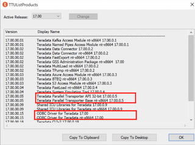
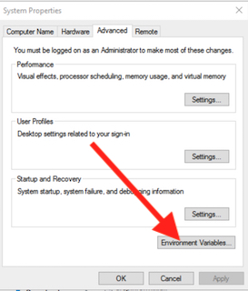
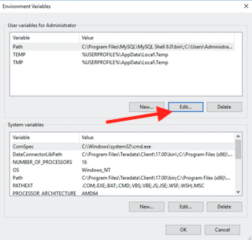
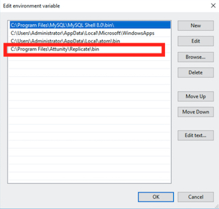

# **_Configuring Teradata 17.00 with Qlik Replicate_**

## **Partner Engineering**

   
 
 
 

John Park  
Principal Solution Architect  
john.park@qlik.com  
  

**Version: 1.2**  
**Initial Release Date: 7-May-20**
**Revisions**      | **Notes**   | **Date**  | **Version**
------------------ | ----------- | --------- | -----------
Initial Draft      | 20-Apr-2020 | John Park | 0.1         |
Review of Language | 23-Apr-2020 | John Park | 0.2         |
Final Edit for V1  | 4-May-2020 | John Park | 1.0         |
Edits for Release  | 8-May-2020 | John Park | 1.2        |

# Table of Contents

--------------------

[**Summary**](#summary)  

[**Part 1 - Checklist - PreConfiguration**](#part-1)

[**Part 2 - Creating Source Connection**](#part-2)

[**Part 3 - Creating Target Connections**](#part-3)

[**Part 4 - Testing and Additional Information**](#part-4)

## **Summary**

This document was created to supplement Qlik Replicate and Teradata 17.00 Release Documentation from Following Pages

- <https://docs.teradata.com/>
- <https://help.qlik.com/en-US/compose/Content/Compose/Home.htm>

Teradata is MPP Database that is supported by Qlik Replicate, Qlik Sense and QlikView 

For This testing and guide we are using Qlik Replicate v6.5 and (TTU) Teradata Tools and Utilities 17.00

## **Part 1**

### Checklist - PreConfiguration

First, we need to set up have a Teradata Database Instance stood up and able to be reached.
For this documentation we tested against installed versions of Teradata 17, 16.2 and 16.1.

On your Windows or Linux box makes sure you have installed TTU and following components

- Teradata Parallel Transporter API
- Teradata Parallel Transporter Base  
- ODBC Driver for Teradata

***For Best Experience and to leverage Teradata to Full Extent we suggest installing BETQ, FastExport, TPump.***
  
***Figure A.1.0.***  
TTUList Screen Capture  
 

#### Install Qlik Replicate and make sure Replicate Server and Replicate UI Services are started

In Windows Services the services names are Attunity Replicate Server and Attunity Replicate Server UI.(Qlik Acquired Attunity in 2019).

Add Replicate Bin Location to Environment Path(Windows).

In Windows the path of default installation is C:\Program Files\Attunity\Replicate\bin.

***Add "C:\Program Files\Attunity\Replicate\bin" to Enviroment Path.***

***Figure A.1.1.***  
Environment Settings  

***Figure A.1.2.***  
Environment Variables  

***Figure A.1.3.***  
Environment Path  

**After the changes restart Qlik Repilcate.**

## **Part 2**

### Creating Source Connection

Now we need to create an Create Qlik Replicate Connection for Teradata with appropriate settings.

**Configure Teradata as a source in Connection Manager for Attunity.**

Click "Manage Endpoint Connections" and follwing window should popup.

Select "Source" as role and "Teradata" as Type.

Enter Credentials for *Teradata Server*, *Username*, *Password*

**Do not Click "Browse" on *"Default Database"* now (We will Do that after Internal Parameters are set).**

Click  on **“Change Processing”** on Top Menu Bar and it should bring Internal Parameter Window

Add Internal Driver for Teradata as Override. If you type keyword "driver" in the prompt is should allow you to click on the variable and add a value.

***Following Setting were used for testing.***  

- Parameter: driver  
- Value: Teradata Database ODBC Driver 17.00

***Press **"Browse"** button select Default database for Replicate and **"Test Connection"** button and Verify Connectivity.***

## **Part 3**

### Creating Target Connection

Now we need to create an Create Qlik Replicate Connection for Teradata with appropriate settings.

**Configure Teradata as a source in Connection Manager for Attunity.**

Click "Manage Endpoint Connections" and follwing window should popup.

Select "Target" as role and "Teradata" as Type.

Enter Credentials for *Teradata Server*, *Username*, *Password*

**Do not Click "Browse" on *"Default Database"* now (We will Do that after Internal Parameters are set).**

Click  on **“Advanced”** on Top Menu Bar and it should bring Internal Parameter Window

Add Internal Driver for Teradata as Override. If you type keyword "driver" in the prompt is should allow you to click on the variable and add a value.

***Following Setting were used for testing.***  

- Parameter: provider  
- Value: Teradata Database ODBC Driver 17.00

Qlik Replicate uses TPT Operator with Attribute which can be tweaked based on environment requirements.

***Press **"Browse"** button select Default database for Replicate and **"Test Connection"** button and Verify Connectivity.***

## **Part 4**

### Testing and Additional Information

If you fail in any of these steps please use the ODBC Manager built in with your os and test connections to your Teradata Server.

For Specific Qlik Replicate functions please follow replicate guidelines to setup and test CDC Tasks.

Additional information can be found in help documentation in [**Summary**](#summary).

For Testing Method Please contact your Qlik or Teradata Representatives for support from Professional services teams.

Othen Information can be found in [Qlik Community Technology Partners](https://community.qlik.com/t5/Technology-Partners-Ecosystem/ct-p/qlik-ecosystem "Qlik Technology Partner Eco System") in Technology Partner Sections where users can post questions and get them answered